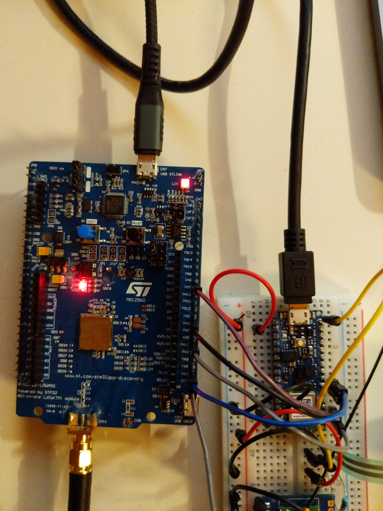

Arduino library to communicate with the murata lorawan board.

### Wiring
- you need to connect power with the power on top or it won't work
- connect it then as follows to your arduino nano ble:

| Type      | Murata | Nano     | Type      |
| --------- | ------ | -------- | --------- |
|           | GND    | GND      |           |
| COMMAND   | PB8    | D3       | RTS       |
| BUSY      | PA8    | D2       | CTS       |
| USART1_RX | PA10   | TX       | UART TX   |
| USART1_TX | PA9    | RX       | UART RX   |

Or you can define your own pins for RTS, CTS and define them as follows:
```
LORAMODEM modem(uint8_t pin_cts, uint8_t pin_rts);
```



### Usage
```
#include "loramodem.h"

LORAMODEM modem;

void setup() {
  modem.begin();
  uint8_t response[255] = {0};
  uint   len = 0;
 
  modem.command(CMD_GETVERSION, response, &len);
  modem.print_arr("response", response, len);
}

void loop() {
}
```
